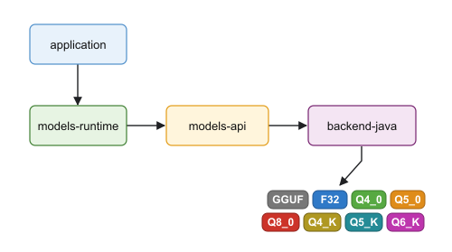

<p align="center">
  
</p>

# models

```
      ███╗   ███╗ ██████╗ ██████╗ ███████╗██╗     ███████╗     ██╗
      ████╗ ████║██╔═══██╗██╔══██╗██╔════╝██║     ██╔════╝     ╚██╗
█████╗██╔████╔██║██║   ██║██║  ██║█████╗  ██║     ███████╗█████╗╚██╗
╚════╝██║╚██╔╝██║██║   ██║██║  ██║██╔══╝  ██║     ╚════██║╚════╝██╔╝
      ██║ ╚═╝ ██║╚██████╔╝██████╔╝███████╗███████╗███████║     ██╔╝
      ╚═╝     ╚═╝ ╚═════╝ ╚═════╝ ╚══════╝╚══════╝╚══════╝     ╚═╝
```

> In-process small-language-model inference for Java 25.

[](LICENSE)
[](https://openjdk.org/projects/jdk/25/)
[](https://github.com/integrallis/mfcqi-java)
[](https://integrallis.github.io/models/)

Models is an in-process inference library for Java applications. It loads an
open-weight language model and generates text without Python, a separate model
server, or a network request.

Models reads GGUF files, Hugging Face Safetensors checkpoint bundles, and the
architecture-specific CACT artifact used by Needle 2. GGUF commonly packages
configuration, tokenizer metadata, and quantized weights in one file. A
Safetensors model is a checked bundle of configuration, tokenizer, and one or
more weight shards. Efficient inference must map the weights, tokenize input,
execute the model layers, maintain context state, and sample and stream output
tokens. Models implements that pipeline on Java 25 and uses the Vector API for
CPU SIMD execution:

- `backend-java` executes every inference kernel in Java.
- `backend-tornado` optionally compiles the Java Q4_0 projection kernels for a
  qualified NVIDIA GPU. It keeps the Models graph in-process and falls back to
  the Vector API when the device or artifact is not eligible.
- `backend-native` runs the same Java 25 and Vector API pipeline, substituting
  only selected, measured bottleneck kernels with a small Models-owned Rust
  library through Java's Foreign Function and Memory (FFM) API.

On supported Apple Silicon Macs, `backend-apple` also exposes Apple's
OS-managed, on-device `SystemLanguageModel` to Java through FFM and a small
Models-owned Swift binary. It uses Apple Intelligence rather than GGUF weights,
and its client plugs into the same Models, LangChain4j, and Spring AI
text-generation contract. See the
[Apple Foundation Models guide](https://integrallis.github.io/models/docs/models/current/apple-foundation-models.html).

The native backend is not a wrapper around llama.cpp or Ollama. Those runtimes
are controlled performance comparators only. The project intends to replace
each Rust kernel with pure Java when a released JDK can provide equivalent
correctness and performance. See [Runtime architecture](https://integrallis.github.io/models/docs/models/current/architecture.html)
for the exact boundary and migration policy.

<p align="center">
  
</p>

## Capabilities

Implemented functionality includes:

- GGUF v2/v3 parsing with memory-mapped tensor access
- strict, memory-mapped single-file and sharded Safetensors bundles
- CACT parsing and the Needle 2 CQ2/CQ4 execution path
- Llama, Qwen2, Qwen3, dense Qwen3.5, and Gemma 4 decoder architectures
- F32, F16, Q4_0, Q5_0, Q8_0, Q4_K, Q5_K, and Q6_K tensor paths
- byte-level BPE and Llama SentencePiece tokenizers
- grouped-query attention, RoPE, SwiGLU, KV caching, and autoregressive decode
- Qwen3.5 hybrid full-attention/Gated DeltaNet decode with reusable recurrent state
- greedy, temperature, top-k, top-p, and repetition-penalty sampling
- tool calling across Qwen, Hermes, Llama 3, Needle 2, Gemma 4, and MiniCPM5 formats,
  with LangChain4j and Spring AI schema-constrained tool decoding for
  enumerable arguments; Needle 2 additionally constrains its array protocol
  from JSON Schema and retrieves the five most relevant tools with its in-model
  contrastive head. Spring AI `ChatClient` requests execute registered Java
  callbacks on both blocking and streaming paths. Generative models receive the
  result for their follow-up answer; Needle 2 completes the action-selection
  loop with the actual Java tool result. ModelJars callers can enforce artifact
  qualification by passing the descriptor capabilities to the adapter
- in-JVM text embeddings with last-token and mean pooling, tested to produce the
  same vectors as llama.cpp
- plain Java, LangChain4j, Spring AI, and Spring Boot integrations
- Apple Foundation Models on supported Apple Silicon Macs
- framework-neutral guarded RAG
- compact WordTour semantic-order models

## Supported Models

Committed same-host evidence covers 29 exact artifacts across 26 model
identities below. Support is bound to an artifact SHA, workload, runtime
selector, backend plan, correctness result, and latency measurements; consult
the qualification ledger for those exact details.

| Model identity | Domain |
|---|---|
| SmolLM2 360M | General |
| SmolLM2 1.7B | General |
| SmolLM3 3B | General |
| Qwen3 1.7B | General |
| Qwen2.5 0.5B | General |
| Qwen2.5 1.5B | General |
| Llama 3.2 1B | General |
| Llama 3.2 3B | General |
| Gemma 3 1B | General |
| Gemma 4 26B-A4B Instruct | General |
| H2O Danube2 1.8B | General |
| DeepSeek-R1-Distill-Qwen 1.5B | General |
| TinyLlama 1.1B Chat | General |
| Qwen3 0.6B | Coding |
| Qwen2.5-Coder 0.5B | Coding |
| Qwen2.5-Coder 1.5B | Coding |
| DeepSeek-Coder 1.3B | Coding |
| MiniCPM5 1B | Coding |
| Yi-Coder 1.5B | Coding |
| Qwen2.5-Math 1.5B | Math |
| EuroLLM 1.7B | Multilingual |
| UmarTransit 1B | Transportation |
| Indian-Legal-Qwen2.5 3B | Legal |
| Nexus Legal | Legal |
| Nexus Finance | Finance |
| Nexus Medical | Healthcare |

Gemma 4 26B-A4B Instruct Q4_K_M is qualified at the usable tier through the
Models Rust/FFM backend. See the
[qualification analysis](GEMMA4_QUALIFICATION.md) and
[retained evidence](benchmark-results/certified-20260825/rag/gemma4-26b-a4b-q4_k_m/README.md).

Qwen2.5 0.5B Instruct BF16 is the first qualified Hugging Face Safetensors
bundle. The pure-Java path is `USABLE` on the controlled EPYC host and is
checked against the same pinned snapshot through Transformers. See the
[retained Safetensors evidence](benchmark-results/certified-20260825/rag/qwen2.5-0.5b-instruct-bf16/README.md).

Dense, text-only Qwen3.5 GGUF execution is integration-tested in pure Java
against pinned llama.cpp token oracles for the 0.8B Q4_K_M and 4B Q4_K_M
artifacts. The 4B gate covers grouped Gated DeltaNet value heads. These
artifacts remain outside the qualified list until their controlled workload
and performance evidence is complete. Qwen3.5 MoE, vision, and MTP execution
are not supported by this release.

- [Model support and qualification](https://integrallis.github.io/models/docs/models/current/model-support.html)
- [Production RAG results](RAG_BENCHMARKS.md)
- [Controlled inference results](INFERENCE_BENCHMARKS.md)

## Install

Models requires Java 25 or newer. For a versioned, qualified artifact, add ModelJars and the marker
JAR for the selected model:

```kotlin
val modeljarsVersion = providers.gradleProperty("modeljarsVersion").get()

dependencies {
    implementation("org.modeljars:modeljars:$modeljarsVersion")
    implementation(
        "org.modeljars.huggingface:" +
            "ggml-org.qwen3-0.6b-gguf.q4_0:" +
            "3.0.0-q4_0.1",
    )
}
```

The ModelJars facade brings Models and both execution backends, then selects the backend qualified
for that exact artifact. Applications that manage their own GGUF files can depend on Models
directly:

```kotlin
val modelsVersion = providers.gradleProperty("modelsVersion").get()

dependencies {
    implementation("com.integrallis:models:$modelsVersion")
    implementation("com.integrallis:backend-java:$modelsVersion") // or backend-native
}
```

For qualified NVIDIA acceleration, add `backend-tornado` and launch with a
matching TornadoVM PTX runtime. The default loader performs eager readiness and
uses the Vector API when the GPU cannot safely retain the compiled plans. See
[Java GPU acceleration](https://integrallis.github.io/models/docs/models/current/gpu-acceleration.html).

Use Apple's on-device system model on a supported Apple Silicon Mac:

```kotlin
dependencies {
    implementation("com.integrallis:backend-apple:$modelsVersion")
}
```

Model marker artifacts, checksums, variants, and measured runtime profiles are
provided by [ModelJars.org](https://modeljars.org). ModelJars is a separate
project and depends on Models; the Models artifacts remain usable without a
catalog dependency.

## Quick Start

```java
import static org.modeljars.catalog.Qwen3_0_6b_Q4_0.MODEL;

var options = SamplingOptions.builder()
    .temperature(0.0f)
    .maxTokens(128)
    .build();

try (var runtime = ModelJars.openRuntime(MODEL)) {
    ModelPrompt prompt = runtime.chatTemplate().render(List.of(
        ChatMessage.system("Classify the user's intent in one phrase."),
        ChatMessage.user("I want to cancel my order")));
    String result = runtime.model().generate(prompt, options);
    System.out.println(result);
}
```

`ModelJars.openRuntime` resolves the pinned artifact, downloads and verifies it when needed, chooses
its qualified Models backend and chat template, and applies a matching performance profile.
Applications that manage
their own GGUF files, supported Hugging Face directories, or CACT artifacts can
use the lower-level `PureJavaBackend.load(Path)` and
`RustFfmBackend.load(Path)` APIs described in the
[Using Models guide](https://integrallis.github.io/models/docs/models/current/using-models.html).
Wrap either backend in `InferencePipeline` for ownership-safe access to the
tokenizer, model metadata, active context window, structured prefill,
forward-pass logits, reset, checkpoint, rewind, and measurements for the most
recent generation. `pipeline.lastGenerationMetrics()` reports tokenization,
prompt preparation, prefill, time to first token, decode and total duration,
along with token counts, prompt-cache reuse, and decode throughput.

Needle 2 CACT artifacts use the same public prompt and parsing APIs. The
`ChatTemplate.NEEDLE2` renderer emits the model's raw tool-schema envelope and
`ToolCallScanner` recovers its array-wrapped calls; callers do not need to
reproduce the CACT reference prompt by hand.

```java
import static org.modeljars.catalog.Cactus_Compute_Needle2_Cact_Cq2_Mixed.MODEL;

var weatherTool = new ToolSpec(
    "get_weather", "Get weather for a city.",
    "{\"type\":\"object\",\"properties\":{\"city\":{\"type\":\"string\"}},"
        + "\"required\":[\"city\"]}");
var options = SamplingOptions.builder().temperature(0).maxTokens(128).build();

try (var runtime = ModelJars.openRuntime(MODEL)) {
    var tools = List.of(weatherTool);
    var prompt = runtime.chatTemplate().render(
        List.of(ChatMessage.user("weather in Lagos")), tools);
    var constraint = ToolCallTokenConstraints.compile(
        runtime.tokenizer(), runtime.chatTemplate().toolSyntax(), tools,
        ignored -> List.of()).orElseThrow();
    var output = runtime.pipeline().generate(prompt, options, constraint);
    var calls = ToolCallScanner.scan(
        output, runtime.chatTemplate().toolSyntax()).toolCalls();
}
```

The loaded `InferencePipeline` also exposes Needle 2's trained auxiliary heads
through `AuxiliaryTextGenerationModel`. `ToolSpecSelector` uses the contrastive
head to reduce declarations larger than five tools and keeps a bounded cache of
schema embeddings. The LangChain4j and Spring AI adapters apply that selection
automatically before rendering the prompt and compiling its decoding grammar.

Streaming uses the same loaded model:

```java
try (var runtime = ModelJars.openRuntime(MODEL)) {
    var prompt = runtime.chatTemplate().render(
        List.of(ChatMessage.user("Explain local inference in one sentence.")));
    runtime.model().generate(prompt, options, new TokenStream() {
        @Override
        public void onToken(String token) {
            System.out.print(token);
        }

        @Override
        public void onComplete() {
            System.out.println();
        }

        @Override
        public void onError(Throwable error) {
            error.printStackTrace();
        }
    });
}
```

Backend diagnostics expose the exact plan selected for the loaded model:

```java
try (var runtime = ModelJars.openRuntime(MODEL)) {
    runtime.model().diagnostics().optimizations().forEach(System.out::println);
}
```

Profile matching, explicit overrides, and every execution-plan switch are
documented in [Execution planning](https://integrallis.github.io/models/docs/models/current/execution-planning.html).

## Integrations

| Integration | Module | Surface |
|---|---|---|
| Plain Java | `models-runtime` | `GenerationLoop` and `TokenStream` |
| LangChain4j | `models-langchain4j` | blocking and streaming chat models with schema-constrained tool calls |
| Spring AI | `models-spring-ai` | observed blocking and streaming chat models with qualified `ChatClient` tool execution |
| Spring Boot | `models-spring-boot-starter` | local Spring AI `ChatModel`, observations, and token-usage meters |
| Guarded RAG | `models-rag` | retrieval abstention, citation validation, and fallback |
| Vector storage | `models-embedding` | optional bridge to `vectors` |
| Apple on-device model | `backend-apple` | Apple Foundation Models through Java FFM |
| Java GPU acceleration | `backend-tornado` | optional Java-authored Q4_0 projections on qualified NVIDIA GPUs |

These adapters are implemented and tested against the same backend contracts;
they do not select hidden inference paths. Their framework dependencies are
caller-owned, and CI composes them with the corresponding Vectors adapters and
starter across the supported versions. See the guides for
[LangChain4j](https://integrallis.github.io/models/docs/models/current/langchain4j.html),
[Spring AI](https://integrallis.github.io/models/docs/models/current/spring-ai.html), and
[Spring Boot](https://integrallis.github.io/models/docs/models/current/spring-boot.html).

## Documentation

The [documentation site](https://integrallis.github.io/models/) covers
architecture, model qualification, execution planning, integrations, guarded
RAG, Javadocs, and release testing.

- [Executable Java notebooks](notebooks/README.md)
- [Apple Foundation Models bridge](models-backend-apple/README.md)
- [Java GPU acceleration](backend-tornado/README.md)
- [Native kernel backend](backend-native/README.md)

## Build

```bash
./gradlew build
./gradlew test
./gradlew integrationTest
./gradlew spotlessApply
```

Real-model tests resolve immutable ModelJars revisions, download missing GGUF
files, verify size and SHA-256, and fail if a required model cannot run. The
complete test matrix and individual large-model tasks are in
[Building and testing](https://integrallis.github.io/models/docs/models/current/testing.html).

## Scope

Models is intended for local and private inference with small, qualified model
artifacts. It is not a training framework, a high-throughput GPU serving system,
or a claim that every GGUF architecture works. Use the qualification ledger for
the exact model, quantization, runtime, workload, and hardware evidence.

## License

Licensed under the [Apache License 2.0](LICENSE).
